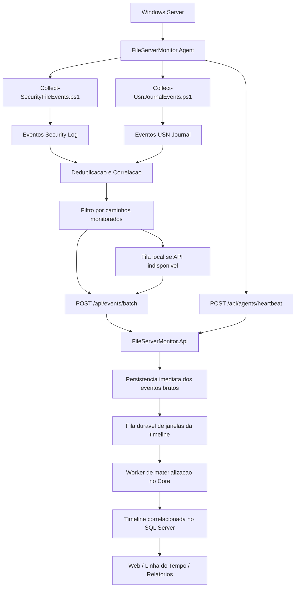

# Coleta e Envio do Agente para a API

Este documento explica como funciona o agente do FileServerMonitor, como ele foi estruturado, como coleta eventos no Windows e como envia esses eventos para a API.

## Resumo curto

O agente e um executavel C# que roda no servidor de arquivos, normalmente como servico do Windows.

Ele nao tenta ler tudo sozinho em C#. Em vez disso, ele orquestra dois coletores PowerShell:

- um coletor do Log de Seguranca do Windows;
- um coletor do USN Journal do NTFS.

Depois disso, o agente junta os eventos, remove duplicidades, aplica correlacao, filtra pelos caminhos configurados, envia os eventos em lote para a API e registra um heartbeat para a tela de saude dos agentes.

## Arquivos principais

- `/Users/andersonbandeira/Projetos/FileServer/src/FileServerMonitor.Agent/Program.cs`
- `/Users/andersonbandeira/Projetos/FileServer/src/FileServerMonitor.Agent/appsettings.agent.json`
- `/Users/andersonbandeira/Projetos/FileServer/src/FileServerMonitor.Agent/scripts/Collect-SecurityFileEvents.ps1`
- `/Users/andersonbandeira/Projetos/FileServer/src/FileServerMonitor.Agent/scripts/Collect-UsnJournalEvents.ps1`
- `/Users/andersonbandeira/Projetos/FileServer/scripts/windows/Install-FileServerMonitorAgent.ps1`
- `/Users/andersonbandeira/Projetos/FileServer/scripts/windows/Configure-FileServerAudit.ps1`
- `/Users/andersonbandeira/Projetos/FileServer/src/FileServerMonitor.Api/Program.cs`
- `/Users/andersonbandeira/Projetos/FileServer/src/FileServerMonitor.Core/EventCorrelation.cs`

## Como o agente foi criado

O agente foi criado como um projeto .NET separado da API e do frontend:

`/Users/andersonbandeira/Projetos/FileServer/src/FileServerMonitor.Agent`

A ideia foi manter o agente pequeno, instalavel no Windows Server e independente da interface web.

Ele tem tres responsabilidades principais:

1. executar coletores locais no Windows;
2. manter estado local de onde parou a coleta;
3. enviar eventos para a API com tolerancia a falha.

O agente foi desenhado para funcionar de duas formas:

- modo console, util para teste manual;
- modo servico Windows, util para producao.

No arquivo `/Users/andersonbandeira/Projetos/FileServer/src/FileServerMonitor.Agent/Program.cs`, a decisao acontece no inicio:

- se estiver no Windows e sem usuario interativo, ele entra no runtime de servico;
- caso contrario, ele roda como console.

O script de instalacao do servico fica em:

`/Users/andersonbandeira/Projetos/FileServer/scripts/windows/Install-FileServerMonitorAgent.ps1`

Esse script registra o executavel `FileServerMonitor.Agent.exe` como servico Windows, usando o arquivo `appsettings.agent.json` como configuracao.

## Configuracao do agente

A configuracao padrao fica em:

`/Users/andersonbandeira/Projetos/FileServer/src/FileServerMonitor.Agent/appsettings.agent.json`

Campos mais importantes:

- `agentId`: identificador unico do agente.
- `server`: nome logico do servidor monitorado.
- `apiBaseUrl`: URL base da API.
- `apiRequestTimeoutSeconds`: tempo limite de cada envio HTTP; use 120 segundos para absorver lotes grandes sem reenviar eventos ainda em processamento.
- `apiBatchSize`: quantidade maxima de eventos por requisicao de ingestao; o padrao 500 aproveita a persistencia em lote sem bloquear o agente na materializacao assincrona da timeline.
- `apiKey`: chave enviada no header `X-Api-Key`, quando autenticacao estiver ligada.
- `pollIntervalSeconds`: intervalo entre ciclos de coleta.
- `batchSize`: limite de eventos por ciclo/lote.
- `enableSecurityLogCollector`: liga/desliga coleta do Log de Seguranca.
- `enableUsnJournalCollector`: liga/desliga coleta do USN Journal.
- `enableCorrelation`: liga/desliga correlacao local antes do envio.
- `enableRemoteConfig`: permite buscar caminhos monitorados na API.
- `filterToConfiguredPaths`: filtra eventos para os caminhos ativos configurados.
- `correlationWindowSeconds`: janela de tempo para correlacionar USN e Security Log.
- `stateFile`: arquivo local com os cursores da coleta.
- `queueFile`: fila local de eventos pendentes.
- `eventIds`: IDs do Log de Seguranca lidos pelo coletor.

No arquivo atual, o Security Log esta ligado por padrao e o USN Journal esta desligado por padrao:

- `enableSecurityLogCollector: true`
- `enableUsnJournalCollector: false`

Para o piloto de correlacao mais forte, especialmente renomeacoes e movimentacoes, o USN Journal deve ser ligado tambem.

## Ciclo de vida do agente

O loop principal fica em `FileServerAgent.RunAsync`.

Em cada ciclo, ele executa esta sequencia:

1. busca configuracao remota na API, se estiver habilitada;
2. envia heartbeat informando que esta rodando;
3. tenta reenviar eventos que ficaram na fila local;
4. coleta novos eventos;
5. correlaciona e filtra;
6. envia lote para a API;
7. grava o estado local;
8. espera o proximo intervalo.

Se algum erro acontecer durante a coleta, ele nao encerra o processo. Ele registra a falha, envia heartbeat com status `degraded` e tenta novamente no proximo ciclo.

Ao finalizar, envia heartbeat com status `stopped`.

## Coleta pelo Log de Seguranca do Windows

O script responsavel e:

`/Users/andersonbandeira/Projetos/FileServer/src/FileServerMonitor.Agent/scripts/Collect-SecurityFileEvents.ps1`

Ele usa `Get-WinEvent` no log `Security`.

Eventos lidos:

- `4663`: acesso a objeto;
- `4660`: exclusao;
- `4670`: mudanca de permissao.

O agente passa para o script:

- ultimo `RecordId` processado;
- quantidade maxima de eventos;
- IDs de eventos;
- nome do servidor;
- nome do compartilhamento padrao.

O script transforma cada evento do Windows em um objeto JSON com campos padronizados:

- `cursorType = security`;
- `recordId`;
- `timestampUtc`;
- `server`;
- `share`;
- `path`;
- `objectType`;
- `action`;
- `user`;
- `sid`;
- `processName`;
- `extension`;
- `source = windows-security-log`.

### Como a acao e interpretada

O script analisa `AccessMask` e `AccessList` para transformar os eventos brutos do Windows em acoes mais legiveis:

- `deleted`;
- `permission_changed`;
- `owner_changed`;
- `created`;
- `created_or_appended`;
- `modified`;
- `accessed`.

Esse log e importante porque normalmente traz o usuario real, SID e processo.

Limite conhecido: o Log de Seguranca sozinho nem sempre informa bem renomeacoes e movimentos. Por isso o USN Journal entra como complemento.

## Coleta pelo USN Journal

O script responsavel e:

`/Users/andersonbandeira/Projetos/FileServer/src/FileServerMonitor.Agent/scripts/Collect-UsnJournalEvents.ps1`

Ele usa:

```powershell
fsutil usn readjournal <volume> startusn=<ultimo_usn> csv
```

O agente passa para o script:

- volume, como `E:` ou `D:`;
- base path monitorado;
- ultimo USN processado;
- tamanho do lote;
- servidor;
- compartilhamento padrao.

O script interpreta o CSV retornado pelo `fsutil`, normaliza nomes de colunas em portugues/ingles e gera eventos JSON com:

- `cursorType = usn`;
- `usn`;
- `volume`;
- `timestampUtc`;
- `server`;
- `share`;
- `path`;
- `previousPath`;
- `objectType`;
- `action`;
- `fileReferenceId`;
- `source = usn-journal`.

### Como o USN vira acao

O script converte os motivos do USN em acoes internas:

- `FILE_CREATE` vira `created`;
- `FILE_DELETE` vira `deleted`;
- `RENAME_OLD_NAME` vira `renamed_old`;
- `RENAME_NEW_NAME` vira `renamed_new`;
- `SECURITY_CHANGE` vira `permission_changed`;
- alteracoes de dados e metadados viram `modified`;
- o restante vira `changed`.

Depois, ele tenta hidratar o caminho completo usando:

- `fileId`;
- `parentFileId`;
- cache local de caminho por arquivo;
- caminho base configurado.

Tambem tenta transformar pares `renamed_old`/`renamed_new` em:

- `renamed`, quando muda apenas o nome;
- `moved`, quando muda a pasta.

O USN e muito bom para ordem tecnica dos eventos, renomeacoes, movimentos e identificador do arquivo.

Limite conhecido: o USN geralmente nao traz usuario real. Por isso ele precisa ser correlacionado com o Security Log.

## Correlacao local antes do envio

Quando `enableCorrelation` esta ligado, o agente chama:

`/Users/andersonbandeira/Projetos/FileServer/src/FileServerMonitor.Core/EventCorrelation.cs`

Esse motor recebe os eventos coletados no ciclo e tenta unir o melhor dos dois mundos:

- USN Journal: melhor para renomeacao, movimento e sequencia tecnica;
- Log de Seguranca: melhor para usuario, SID, processo e confirmacao de acesso.

Exemplo pratico:

1. USN diz que um arquivo foi renomeado, mas usuario vem como `UNKNOWN`.
2. Security Log tem evento quase no mesmo horario para o mesmo caminho, com usuario `TCE-AL\anderson.bandeira`.
3. A correlacao gera um evento com origem `usn-journal+security-log`, mantendo a estrutura do USN e enriquecendo com usuario/processo do Security Log.

Tambem existe logica para:

- consolidar pares de rename do USN;
- diferenciar rename de move;
- reduzir ruido de arquivos temporarios;
- tratar nomes provisiorios do Windows/Office;
- preservar `accessed` quando o Security Log confirma leitura;
- suprimir eventos redundantes do Security Log quando ja foram absorvidos pelo USN.

## Deduplicacao no agente

Antes de enviar, o agente remove duplicidades em `DeduplicateCollectedEvents`.

Exemplos:

- eventos repetidos de exclusao vindos do Security Log no mesmo segundo;
- eventos repetidos de `created_or_appended`;
- eventos em que existe uma versao melhor com origem `usn-journal+security-log`.

A prioridade interna favorece:

1. eventos correlacionados;
2. eventos do Security Log;
3. eventos do USN puro.

Para a acao, eventos como `created`, `renamed` e `deleted` recebem prioridade maior que `changed` e `accessed`.

## Estado local

O agente mantem um arquivo de estado:

`state/agent-state.json`

Esse arquivo guarda:

- `LastRecordId`: ultimo registro lido do Log de Seguranca;
- `LastUsnByVolume`: ultimo USN lido por volume;
- `LastSuccessfulSendUtc`: horario do ultimo envio bem-sucedido.

Esse estado evita reler tudo a cada ciclo.

Importante: o estado so avanca depois que o lote e enviado com sucesso para a API, ou quando nao ha evento habilitado para envio.

## Fila local de contingencia

Se a API estiver fora, lenta ou rejeitar o lote, o agente nao perde os eventos.

Ele grava os eventos no arquivo:

`state/pending-events.ndjson`

Cada linha e um evento JSON.

No proximo ciclo, antes de coletar novos eventos, ele tenta enviar a fila local.

Quando o envio da fila da certo:

1. remove da fila os eventos enviados;
2. avanca os cursores;
3. atualiza `LastSuccessfulSendUtc`.

O heartbeat tambem informa quantos eventos estao pendentes na fila.

## Configuracao remota

Se `enableRemoteConfig` estiver ligado, o agente consulta:

`GET /api/agents/config?server=<servidor>`

A API responde com:

- servidor;
- compartilhamento padrao;
- volumes USN derivados dos caminhos monitorados;
- lista de caminhos ativos.

O agente usa isso para:

- saber quais volumes USN deve ler;
- escolher o melhor base path para o volume;
- filtrar eventos para os caminhos ativos.

O endpoint da API monta essa configuracao a partir dos caminhos cadastrados em `/api/monitored-paths`.

## Envio dos eventos para a API

O envio principal usa:

`POST /api/events/batch`

O payload e uma lista de eventos no formato `FileAuditEventRequest`.

Campos enviados:

- `timestampUtc`;
- `server`;
- `share`;
- `path`;
- `previousPath`;
- `objectType`;
- `action`;
- `user`;
- `sid`;
- `sourceHost`;
- `sourceIp`;
- `processName`;
- `fileSizeBytes`;
- `extension`;
- `result`;
- `severity`;
- `source`.

Se a autenticacao estiver ligada na API, o agente envia a chave no header:

`X-Api-Key`

O envio em lote aceita ate 1000 eventos por requisicao.

## Recebimento na API

Os endpoints principais ficam em:

`/Users/andersonbandeira/Projetos/FileServer/src/FileServerMonitor.Api/Program.cs`

### `POST /api/events`

Recebe um unico evento.

Fluxo:

1. converte `FileAuditEventRequest` em `FileAuditEvent`;
2. normaliza campos obrigatorios usando o Core;
3. grava no repositorio;
4. executa regras de alerta;
5. retorna `Created`.

### `POST /api/events/batch`

Recebe um lote.

Fluxo:

1. rejeita lote vazio;
2. rejeita lote com mais de 1000 eventos;
3. normaliza todos os eventos;
4. grava em lote;
5. executa regras de alerta;
6. retorna `Accepted`.

### Persistencia

A API usa `IEventRepository`.

Hoje existem dois modos:

- `SqlServerEventRepository`;
- `InMemoryEventRepository`.

No SQL Server, os eventos sao gravados na tabela:

`dbo.FileAuditEvents`

Campos principais:

- `Id`;
- `TimestampUtc`;
- `ServerName`;
- `ShareName`;
- `FullPath`;
- `PreviousPath`;
- `ObjectType`;
- `ActionName`;
- `UserName`;
- `Sid`;
- `SourceHost`;
- `SourceIp`;
- `ProcessName`;
- `FileSizeBytes`;
- `Extension`;
- `ResultName`;
- `Severity`;
- `SourceName`.

## Heartbeat do agente

Além dos eventos, o agente envia saude operacional para:

`POST /api/agents/heartbeat`

Campos enviados:

- `agentId`;
- `server`;
- `status`;
- `version`;
- `lastRecordId`;
- `lastUsnByVolume`;
- `message`;
- `pendingQueueEvents`;
- `lastSuccessfulSendUtc`.

A API guarda esses dados em memoria e, quando configurada com SQL Server, tambem persiste em:

`dbo.AgentHeartbeats`

A interface consulta:

`GET /api/agents/health`

Esse endpoint marca agente como:

- `running`, quando esta saudavel;
- `degraded`, quando reportou erro;
- `backlog`, quando a fila local passou do limite;
- `stale`, quando parou de mandar heartbeat.

## Autenticacao

A API pode exigir chave de API.

A configuracao fica em:

- `Auth:Enabled`;
- `Auth:ApiKey`;
- `Auth:AdminApiKey`.

Quando ligada, a API aceita a chave pelo header:

`X-Api-Key`

Rotas anonimas:

- `/`;
- `/health`.

Rotas administrativas exigem chave administrativa, como administracao de caminhos, alertas e auditoria administrativa.

## Preparacao do Windows para coleta

Para o Security Log funcionar bem, o Windows precisa estar auditando acesso aos caminhos monitorados.

O script de apoio e:

`/Users/andersonbandeira/Projetos/FileServer/scripts/windows/Configure-FileServerAudit.ps1`

Ele adiciona regra SACL nos caminhos informados.

Direitos auditados pelo script:

- criacao de arquivos e pastas;
- escrita e append;
- exclusao;
- mudanca de permissao;
- tomada de propriedade;
- escrita de atributos.

Observacao importante: eventos de leitura/acesso podem depender de direitos adicionais de auditoria. Para o caso de "arquivo acessado", alem da SACL correta, o teste precisa realmente ler bytes do arquivo, nao apenas abrir e fechar.

## Diagrama do fluxo



## O que esta maduro

O agente ja tem uma base boa para piloto:

- roda como console ou servico Windows;
- tem configuracao por JSON;
- suporta chave de API;
- coleta Security Log;
- suporta coleta USN Journal;
- mantem cursores locais;
- evita avancar estado quando envio falha;
- tem fila local para contingencia;
- envia eventos em lote;
- envia heartbeat;
- busca configuracao remota;
- filtra caminhos monitorados;
- chama o motor de correlacao do Core antes do envio.

## Pontos que ainda merecem atencao

### USN desligado por padrao

No `appsettings.agent.json`, `enableUsnJournalCollector` esta `false`.

Para ambientes onde renomeacao e movimentacao sao essenciais, ele deve ser ligado.

### Coleta USN via `fsutil`

O coletor USN usa `fsutil usn readjournal`.

Isso funcionou como abordagem pratica para piloto, mas uma versao futura pode trocar por leitura nativa/PInvoke para ganhar mais controle, estabilidade e metadados.

### Caminho completo no USN

O USN retorna nome, IDs e motivos, mas nem sempre entrega o caminho completo pronto.

O script tenta reconstruir caminhos com cache de `fileId` e `parentFileId`. Em cenarios muito longos, apos reinicio ou quando o pai nao apareceu no lote, pode haver caminho menos preciso.

### Acesso/leitura depende da auditoria

O evento `accessed` depende da politica de auditoria e da SACL configurada no Windows.

Se o ambiente auditar apenas escrita/exclusao, acesso de leitura pode nao aparecer.

### Separacao entre evento bruto e timeline limpa

A API persiste o lote bruto e a janela temporal de materializacao na mesma transacao SQL antes de responder ao agente. Um worker em segundo plano reivindica esse trabalho com lease temporario e materializa a timeline com as regras do Core.

As janelas sobrepostas sao acumuladas; janelas temporalmente distantes permanecem separadas. A materializacao aguarda um curto periodo para absorver rajadas, com espera maxima para nao ficar bloqueada por trafego continuo.

No SQL Server, a fila fica em `dbo.TimelineMaterializationJobs`. Um trabalho concluido e removido; uma falha o devolve para `pending`. Se a API cair durante a correlacao, o lease expira e outra instancia ou o processo reiniciado retoma o trabalho automaticamente. Assim, nao existe uma janela entre gravar o evento bruto e registrar que a timeline precisa ser atualizada.

Consequencias operacionais:

- o agente nao fica bloqueado pela correlacao da timeline;
- a fila local volta a zero assim que a API aceita e persiste o lote;
- eventos e relatorios servem o ultimo snapshot estavel enquanto a proxima janela converge;
- a timeline pode ficar alguns segundos atras do evento bruto durante rajadas;
- reiniciar ou encerrar abruptamente a API nao perde uma janela ja confirmada no banco;
- falhas do worker devolvem a janela para nova tentativa sem descartar trabalho recebido durante a falha;
- `POST /api/events/timeline/rebuild` permite reconstruir manualmente um periodo quando necessario.

O frontend apenas consulta e renderiza a timeline entregue pela API/Core; ele nao deve reimplementar heuristicas de correlacao.

## Checklist operacional

Para validar o fluxo completo:

1. confirmar que a API esta acessivel em `apiBaseUrl`;
2. confirmar `X-Api-Key`, se autenticacao estiver ligada;
3. cadastrar caminhos monitorados na API;
4. configurar auditoria NTFS nos caminhos;
5. ligar `enableSecurityLogCollector`;
6. ligar `enableUsnJournalCollector` quando precisar de renomeacao/movimento com mais precisao;
7. iniciar o agente;
8. verificar `/api/agents/health`;
9. executar o roteiro de teste;
10. verificar `/api/events`;
11. confirmar se `state/pending-events.ndjson` ficou vazio.
