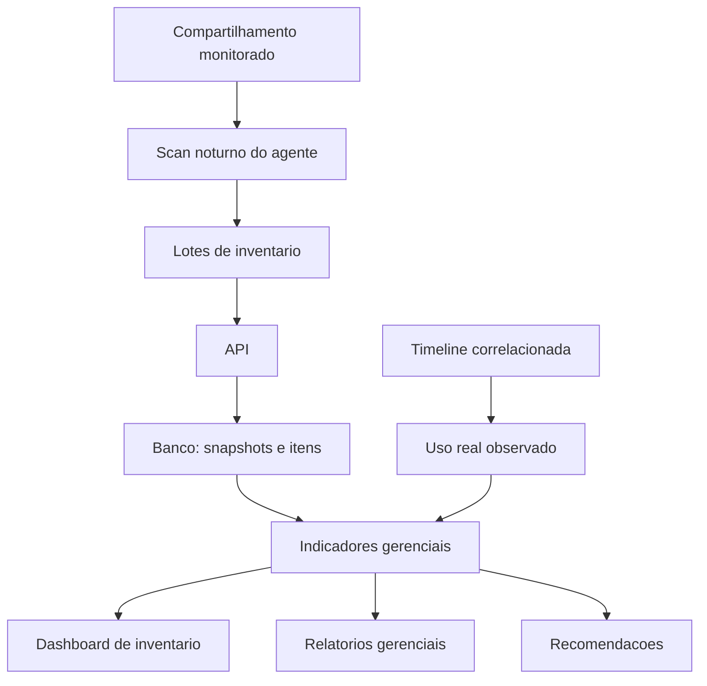

# File Inventory Governance Design

## Contexto

O FileServer Monitor ja possui auditoria baseada em eventos correlacionados do Security Log e USN Journal. Essa camada responde "o que aconteceu", "quem fez" e "quando aconteceu". O novo modulo de inventario gerencial nao substitui essa auditoria. Ele acrescenta uma visao de estado atual e historico agregado do compartilhamento para apoiar governanca, capacidade, limpeza e tomada de decisao.

## Objetivo

Criar uma camada de inventario gerencial do file server, alimentada por scans agendados fora do horario de expediente e enriquecida pela timeline correlacionada. A aplicacao deve conseguir mostrar arquivos mortos, pastas que mais ocupam espaco, crescimento, tipos de arquivo, itens suspeitos, atividade por usuario e recomendacoes operacionais.

## Principios

- A correlacao de auditoria continua no Core e permanece como fonte principal para eventos de seguranca.
- O inventario representa o estado observado do filesystem em determinado momento.
- O scan deve ser controlado, agendavel e seguro para ambiente grande, evitando concorrencia com horario de pico.
- A primeira fase deve coletar metadados baratos: caminho, tipo, tamanho, extensao e datas do filesystem.
- ACLs, hash e analises profundas entram em fases posteriores, porque sao mais caros.
- O usuario de bind/scan pode ser configurado depois na area de AD, mas o agente deve aceitar execucao com uma conta de servico que tenha permissao de leitura ampla.

## Arquitetura

## Fluxo Do Scan

1. O agente inicia um scan agendado ou manual.
2. O agente percorre os caminhos configurados.
3. Para cada arquivo ou pasta, coleta metadados basicos.
4. O agente envia lotes para a API.
5. A API cria ou atualiza um snapshot.
6. A API marca itens vistos como ativos.
7. Ao finalizar, itens que existiam no snapshot anterior e nao foram vistos podem ser marcados como nao vistos/removidos em fase posterior.
8. Indicadores sao calculados para dashboard e relatorios.

## Dados Da Primeira Fase

Cada item de inventario deve guardar:

- servidor;
- compartilhamento;
- caminho completo;
- caminho relativo;
- nome;
- tipo: arquivo ou pasta;
- extensao;
- tamanho em bytes;
- profundidade;
- data de criacao do filesystem;
- data de modificacao do filesystem;
- data de ultimo acesso do filesystem, quando disponivel;
- snapshot em que foi visto;
- status atual;
- erro de leitura, se houver.

Cada snapshot deve guardar:

- identificador;
- servidor;
- compartilhamento;
- caminho raiz;
- inicio e fim;
- status;
- quantidade de arquivos;
- quantidade de pastas;
- tamanho total;
- quantidade de erros;
- mensagem de erro consolidada.

## Indicadores Iniciais

A primeira versao do dashboard deve mostrar:

- tamanho total inventariado;
- total de arquivos;
- total de pastas;
- ultimo scan;
- erros do ultimo scan;
- top pastas por tamanho;
- top extensoes por tamanho;
- arquivos sem modificacao recente;
- arquivos grandes;
- distribuicao por idade.

## Fases Futuras

### Fase 2: Cruzamento Com Eventos

Cruzar inventario com a timeline persistida para calcular ultimo acesso real, ultimo usuario observado, pastas mais acessadas, pastas mais alteradas e usuarios mais ativos.

### Fase 3: Permissoes

Coletar ACLs, identificar permissoes amplas, permissoes explicitas, heranca quebrada e grupos sensiveis. Essa fase deve depender de conta com permissao elevada e deve ser opcional por custo.

### Fase 4: Recomendacoes

Gerar achados como arquivos mortos, arquivos grandes sem uso, extensoes suspeitas, pastas frias, crescimento anormal e permissao ampla.

### Fase 5: Relatorios Executivos

Criar relatorios de limpeza recomendada, crescimento por area, governanca de permissoes, arquivos suspeitos e resumo mensal executivo.

## Riscos E Cuidados

- Scan completo em ambiente de 8 TB pode demorar muito; deve rodar de madrugada e em lotes.
- Hash completo de arquivos grandes nao deve ser padrao.
- Leitura de ACL pode ser cara; deve ser fase posterior e opcional.
- O agente precisa registrar progresso e erros para nao parecer travado.
- O banco precisa de indices por servidor, compartilhamento, caminho, extensao, tamanho e datas.

## Primeira Entrega Recomendada

Implementar inventario basico com:

- contratos de item e snapshot no Core;
- endpoint de ingestao de lote na API;
- repositorio SQL Server e memoria;
- endpoint de resumo gerencial;
- scan simples no agente com envio em lotes;
- primeira aba de frontend com overview e rankings.
